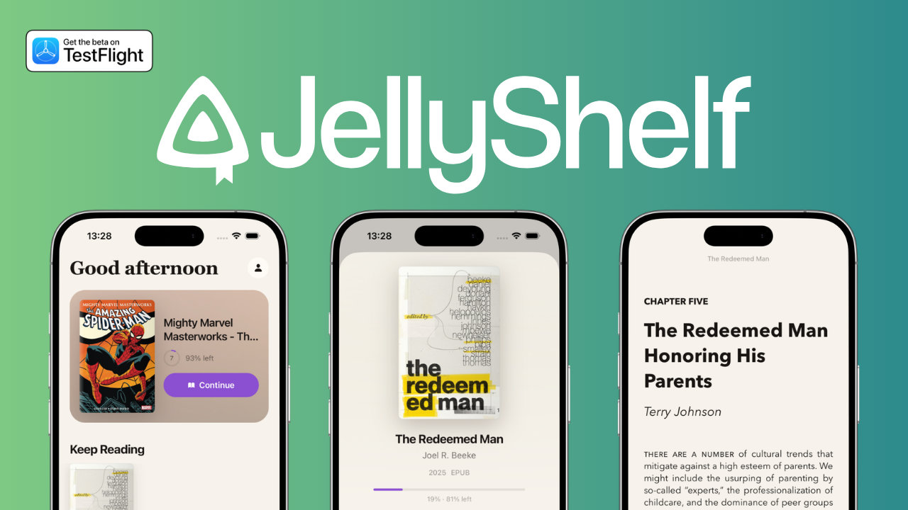

<p align="center">
  
</p>

<p align="center">
  <strong>A native iOS reader for the books, comics and PDFs in your Jellyfin library.</strong>
</p>

<p align="center">
  <a href="https://self-shelf-web.vercel.app"><strong>self-shelf-web.vercel.app</strong></a>
</p>

<p align="center">
  
  
  
  
</p>

---

Jellyfin is great at storing your library. It is not great at reading it on a phone. Self-Shelf
signs into your server, pulls down the shelf, and gets out of the way so you can read.

Everything is local-first. Your place in a book, your bookmarks, your highlights and your type
settings live in SQLite on the device, so the app opens instantly and works on a plane. Progress
is pushed back up to Jellyfin when the server is reachable.

## Try it

- **Web:** [self-shelf-web.vercel.app](https://self-shelf-web.vercel.app) is open to everyone. Sign in with
  your own Jellyfin server and start reading in the browser.
- **iOS:** The native app is being tested through TestFlight.

## What it does

**Your library, the way you left it**
- Keep Reading, Recently Added, Readlist and Finished shelves on the home tab
- Full library grid with sort by title, date added, rating or year
- Filters for favorites, unread, in progress and downloaded
- Search across the whole server
- Favorites and read state sync both ways with Jellyfin

**A reader worth using**
- EPUB, PDF, CBZ and CBR, all rendered in a sandboxed WebView engine
- Six themes: Original, Paper, Sepia, Bold, Quiet and Night, with page dimming for scanned PDFs
- Eleven fonts that already ship with iOS, so nothing downloads and nothing falls back to the wrong face
- Type size, line spacing, margins, justification, paged or scrolled flow
- Right-to-left reading direction for manga
- Bookmarks, highlights and notes, restored on the page when you come back
- Table of contents, a drag scrubber with haptics, and pages-left-in-chapter
- Screen stays awake while you read

**Offline and on-device**
- Download any book for offline reading, with live progress and a size readout
- Drop your own EPUBs and PDFs into the Self-Shelf folder in Files and they show up on the shelf
- Filenames like `Austen, Jane - Emma.epub` are parsed for title and author automatically
- Sign in with a username and password, or with Quick Connect if your server has it turned on

**Native where it counts**
- Liquid Glass surfaces on iOS 26, with a blur fallback everywhere else
- Native tab bar that tucks away as you scroll down a shelf
- SF Symbols, haptics, light and dark appearance

## Requirements

- A Jellyfin server with the [Bookshelf plugin](https://github.com/jellyfin/jellyfin-plugin-bookshelf) installed
- Xcode 26 and an iOS 26 device or simulator
- Node 20 or newer

## Getting started

```bash
git clone https://github.com/jacclyons/JellyShelf.git
cd JellyShelf
npm install
npm run ios
```

Self-Shelf uses native modules, so Expo Go will not work. `npm run ios` builds and installs a dev
client. After that, `npm start` is enough for day to day work.

On first launch you get a short walkthrough, then a sign-in screen. Type your server address the
way you would in a browser (`jellyfin.home.lan:8096` is fine, so is a pasted web client URL) and
Self-Shelf will sort out the scheme and strip the `/web` suffix.

## Scripts

| Command | What it does |
| --- | --- |
| `npm start` | Start Metro against the dev client |
| `npm run ios` | Build and run on a simulator or device |
| `npm run prebuild` | Regenerate the native project from scratch |
| `npm run typecheck` | `tsc --noEmit` |
| `npm run lint` | Expo lint |

## How it works

The reader is a single HTML file with epub.js, pdf.js, JSZip and unrar.wasm vendored alongside it.
It is copied out of the bundle into a hidden folder on first run and loaded over `file://`, which
means the WebView can `fetch()` any book on disk without a server in the middle. React Native and
the engine talk over a small typed message protocol, so the native side owns navigation, chrome and
persistence while the WebView only paints pages.

Books live under `Documents/` so that both halves of that story work at once: iOS shows the folder
as "Self-Shelf" in the Files app for your own EPUBs, and downloads from Jellyfin land in a
dot-prefixed subfolder the Files app leaves alone.

```
src/
  api/       Hand-written slice of the Jellyfin API, plus React Query hooks
  app/       expo-router screens (tabs, book detail, reader, settings, sign-in)
  reader/    WebView bridge, appearance and contents sheets, scrubber
  state/     Auth session, SQLite store, reader preferences
  lib/       On-disk layout, downloads, local book scanning, metadata
  ui/        Theme, glass surfaces, covers, shelves, shared bits
assets/
  reader/    The reader engine and its vendored libraries
```

## Notes

- Built and tested on iOS. The Android config is in place and the code paths exist, but there is no
  prebuilt Android project in the repo yet.
- Nothing leaves your device except calls to your own Jellyfin server. There is no analytics, no
  account and no third-party backend.
- Sessions are kept in the iOS keychain via `expo-secure-store`.
- Claude Code was used throughout development of this project, alongside hand-written code and review.
